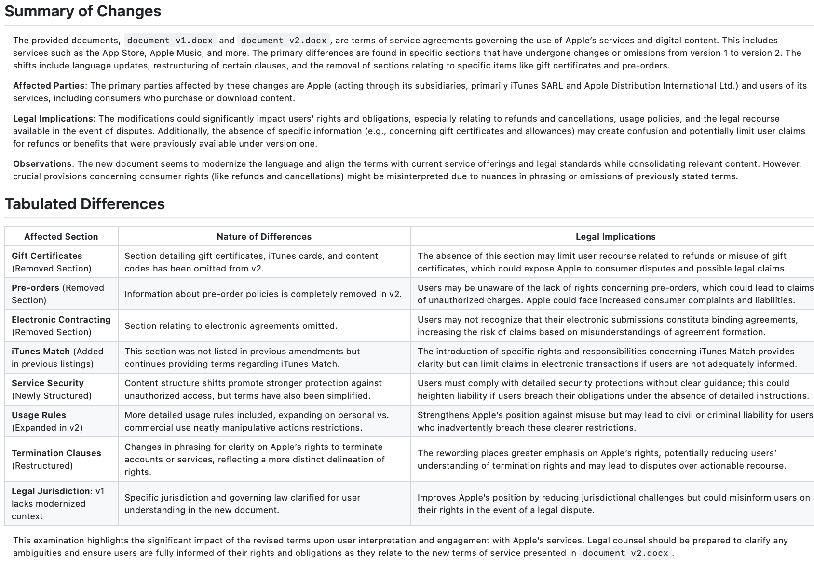

Here’s your updated `README.md`, incorporating the OpenAI API key requirement and refining the structure for clarity and professionalism.

---

# AI Document Comparison on Legal Documents

[]()
[](https://megpatakota.co.uk)

> ⚠️ **Disclaimer:** This project is a work in progress. Features, code structure, and documentation may evolve over time.

## Table of Contents
- [Overview](#overview)
- [Installation](#installation)
- [Usage](#usage)
- [Output](#output)
- [Contributing](#contributing)
- [License](#license)

---

## Overview

This project is a **document processing pipeline** that standardizes, extracts, and compares structured sections from input documents using **LLMs** and **text-processing techniques**. 

The pipeline:
- **Extracts key sections** from `.docx` legal documents.
- **Standardizes content** using a predefined template.
- **Compares versions** of documents to highlight differences.

It includes two main pipelines:
1. **Pipeline 1**: Standard processing for extracting and comparing document sections.
2. **Pipeline 2 (Simple LLM)**: Uses an LLM-based approach to extract structured sections.


---

## Installation

### Prerequisites
- Python 3.13+
- Poetry (for dependency management)
- An **OpenAI API Key** for LLM-based processing

### Clone the Repository

```bash
git clone https://github.com/yourusername/ai_doc_comparison_legal.git
cd ai_doc_comparison_legal
```

### Install Dependencies
Using Poetry:

```bash
poetry install
```

### Set Up Your API Key

To use OpenAI's LLM services, set your API key as an environment variable:

```bash
export OPENAI_API_KEY="your-api-key-here"
```

Alternatively, create a `.env` file in the project root:

```
OPENAI_API_KEY=your-api-key-here
```

---

## Usage

### Running Pipeline 1 (Standard Processing)
```bash
poetry run python pipeline1.py 
```

### Running Pipeline 2 (LLM-based Processing)
```bash
poetry run python simple_llm.py 
```

---

## Output

The extracted and compared sections are stored as `.json` or `.txt` files.

- Use **Markdown Preview** tools like [Markdown Live Preview](https://markdownlivepreview.com) to format and view `.txt` outputs more clearly.
- Example output 


---

## Contributing

Contributions are welcome! Please follow these steps:
1. Fork the repository.
2. Open an issue to discuss proposed changes.
3. Submit a pull request with a detailed explanation of modifications.

I look forward to community contributions! Feel free to contact me via [my website](https://megpatakota.co.uk) for discussions or suggestions.

---

## License

This project is maintained by **Meg Patakota**. All rights reserved. Redistribution or commercial use without explicit permission is prohibited.
