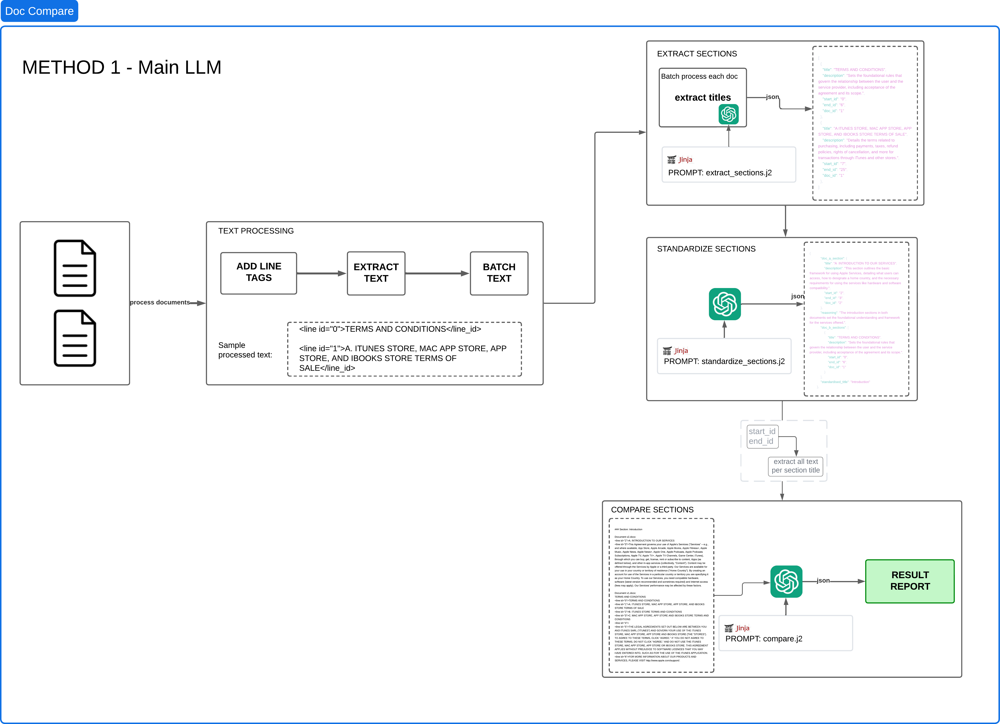
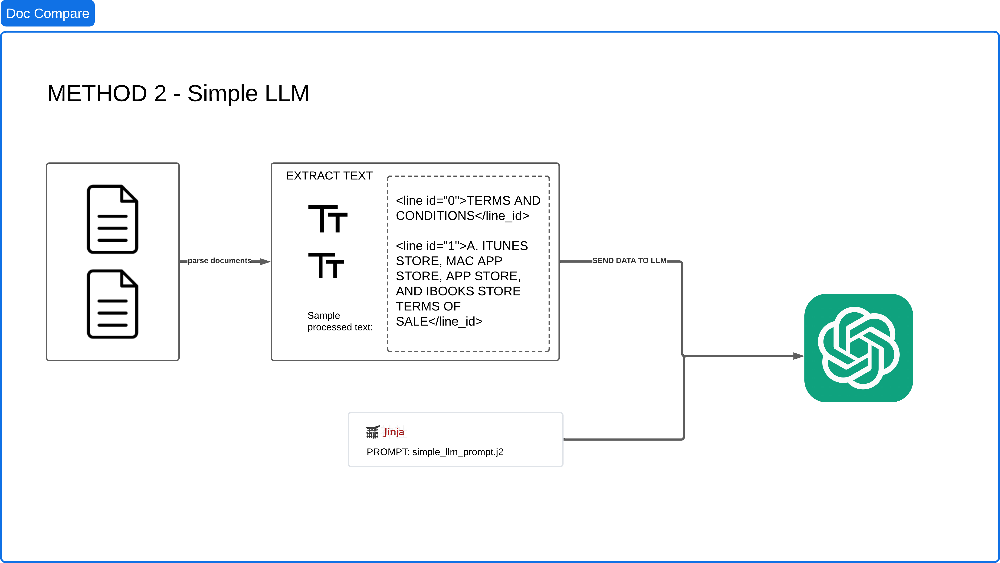

# AI Document Comparison on Legal Documents

[]()
[](https://megpatakota.co.uk)

> ⚠️ **Disclaimer:** This project is a work in progress. Features, code structure, and documentation may evolve over time.

## Table of Contents
- [Overview](#overview)
    - [Methods/Approaches Used](#methodsapproaches-used)
    - [Evaluation](#evaluation)
- [Installation](#installation)
- [Usage](#usage)

---

## Overview

This project is a **document processing pipeline** that standardizes, extracts, and compares structured sections from input documents using **LLMs** and **text-processing techniques**. 

### Methods/Approaches Used

It includes two main pipelines:
1. **Method 1 (Main LLM)**: Standard processing for extracting and comparing document sections.
    - **Extracts key sections** from `.docx` legal documents.
    - **Standardizes content** using a predefined template.
    - **Compares versions** of documents to highlight differences.


2. **Method 2 (Simple LLM)**: Uses an LLM-based approach to extract structured sections.
    - Uses the entire document text as is and the LLM receives the entire document.


Each of these methods have been run against three OpenAI models: GPT-4o-mini, GPT-4o, and o1. The final outputs you see have been run against `o1` model as it provided stronger reasoning for the purposes of my analysis.

### Evaluation
- Evaluation of the method 1 and method 2
    - Using a prompt template and asking the LLM to score the two outputs (each criterion is out of 4)
    - Each criterion is out of 4 and an overall percentage grads is calculated
    - Results in [Evaluation Results](./data/output/evaluation_results.json)

---

## Installation

### Prerequisites
- Python 3.12+
- Poetry (for dependency management)
- An **OpenAI API Key** for LLM-based processing

### Clone the Repository

```bash
git clone https://github.com/yourusername/ai_doc_comparison_legal.git
cd ai_doc_comparison_legal
```

### Install Dependencies
Using Poetry:

```bash
poetry install
```

### Set Up Your API Key

To use OpenAI's LLM services, set your API key as an environment variable:

```bash
export OPENAI_API_KEY="your-api-key-here"
```

Alternatively, create a `.env` file in the project root:

```
OPENAI_API_KEY=your-api-key-here
```
Note that the default model is set to `gpt-4o-mini` due to cost implications but feel free to change the config.py file to choose a better performing model like `gpt-4o` or `o1`

---

## Usage

### Running Method 1 
```bash
poetry run python llm_main.py 
```
[Output from this method](data/output/final_output_main_llm.txt)

### Running Method 2 
```bash
poetry run python llm_simple.py 
```
[Output from this method](data/output/final_output_simple_llm.txt)

### Running Evaluation
This evaluation method will only work if you run the above 2 methods.
```bash
poetry run python evaluation.py
```
[Output from this evaluation](data/output/evaluation_results.json)


---
## Next Steps
- Expand Model Exploration beyond OpenAI
    - Test with Anthropic Claude, Mistral, and Gemini models to compare outputs beyond OpenAI models.
- Refine Evaluation Metrics & Scoring
    - Collaborate with domain experts (e.g., legal professionals) to refine the rubric and scoring mechanism.
    - Introduce explainability techniques to justify why an output scores higher/lower.
    - Benchmark against human-reviewed legal document comparisons for a more robust evaluation.
- Optimize Cost vs. Performance Trade-Offs
    - Investigate token efficiency: Reduce token usage without compromising output quality.
    - Implement adaptive model selection: Run cheaper models for simple tasks and switch to higher-cost models for complex sections.
- Improve Processing Pipeline
    - Introduce multi-stage document chunking to improve extraction accuracy.
    - Use vector-based retrieval (e.g., FAISS, Pinecone) for better structured comparisons.
    - Add error-handling & retry mechanisms for more robust processing.

---

## Contributing

Contributions are welcome! Please follow these steps:
1. Fork the repository.
2. Open an issue to discuss proposed changes.
3. Submit a pull request with a detailed explanation of modifications.

I look forward to community contributions! Feel free to contact me via [my website](https://megpatakota.co.uk) for discussions or suggestions.

---

## License

This project is maintained by **Meg Patakota**. All rights reserved. Redistribution or commercial use without explicit permission is prohibited.
